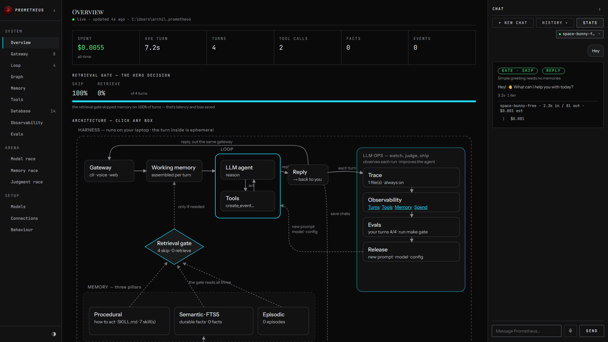

# Prometheus Agent



Visit - https://engine-user.github.io/Prometheus-AI-Agent/ - for more details

Meet **Prometheus** — Your own a local-first personal assistant that shows the four pillars behind every
serious agent: **Harness · Loop · Memory · Eval/LLM-Ops**. No frameworks hiding the good parts.

- **Local-first.** Your memory is one SQLite file. Open it. Read it. It's yours.
- **Memory is the hero.** Semantic + episodic + procedural — with a gate that decides *whether*
  to remember, and a pass that decides *what* to keep.
- **The loop is ~95 lines** of plain Python. Step through it.
- **Watch it think.** A local dashboard lights up every message as it flows through the harness.
- **Eval built in.** Deterministic tests *and* LLM-as-judge, side by side, with a release gate.

## Quickstart

Just want to run it:

```bash
pip install prometheus
prometheus                                    # talk to your Prometheus in the terminal
prometheus dashboard                          # …or the browser cockpit → localhost:7777
```

It will tell you which key to set the first time. Want to **read the code** (the
point of this repo) or contribute — clone it instead:

```bash
git clone https://github.com/Engine-User/Prometheus-AI-Agent && cd Prometheus-AI-Agent
uv venv && uv pip install -e .          # create the env + install the `prometheus` command
cp .env.example .env                    # pick a provider, paste ONE key
uv run prometheus                             # talk to your Prometheus in the terminal
uv run prometheus dashboard                   # …or the browser cockpit → localhost:7777
```

**Now try it.** *"Remember that Engineer prefers morning meetings."* Quit. Restart.
*"Book a catch-up with Engineer on Friday."* → it remembers, and books 9am. Your memory is one
file: `~/.prometheus/state.db`, the same from every folder.

**Use the model you already pay for.** Anthropic (default), OpenAI, Gemini, DeepSeek, MiniMax,
Kimi, GLM, OpenRouter (one key, hundreds of hosted models), OpenCode Zen, or OpenCode Go —
set `PROMETHEUS_PROVIDER=`, paste the key, done. One dialect in the loop;
a [~60-line adapter](prometheus/loop/models.py) handles the rest.

New to it? **[Getting started](docs/getting-started.md)** walks the whole setup, with a check
at the end of every step.

## Connect Prometheus Memory

Prometheus's own memory is local. But you can connect to other sources of memory as you like, locally.

```bash
pip install 'prometheus[mcp]'           # in a checkout: uv pip install -e '.[mcp]'
prometheus connect prometheus-memory                # or any other memory store.
prometheus skill export --to claude,codex     # carry Prometheus's skills to Claude Code and Codex too
```

## What's inside

| Pillar                   | In one line                                                                                                               | Read more                                  |
| ------------------------ | ------------------------------------------------------------------------------------------------------------------------- | ------------------------------------------ |
| **Harness**        | gateways (terminal, dashboard, voice, Telegram, Discord, WhatsApp) and tools around one loop                              | [architecture](docs/architecture.md)        |
| **Loop**           | ~95 lines of plain Python: reason, act, repeat, with two ways to stop                                                     | [the tour](docs/tour.md#the-loop)           |
| **Memory**         | semantic, episodic and procedural (skills); a gate decides*whether* to remember, consolidation decides *what* to keep | [the tour](docs/tour.md#the-retrieval-gate) |
| **Eval / LLM-Ops** | deterministic tests and LLM-as-judge side by side, a release gate, a trace for every turn                                 | [evals](docs/evals.md)                      |

**How is this different from ChatGPT or Claude Desktop?** Those are products you *use*. This is a
codebase you *own*: the loop, the memory schema, the gate and the eval harness are all yours to
read and change. Versus the big open-source assistants (OpenClaw, Hermes)? Same architecture,
1/100th the code.

## Docs

| Read                                                       | For                                                                        |
| ---------------------------------------------------------- | -------------------------------------------------------------------------- |
| [Getting started](docs/getting-started.md)                  | installing, the first run, connecting Prometheus Memory                    |
| [The tour](docs/tour.md)                                    | the dashboard, things to try, the loop, graph workflows, skills            |
| [Architecture](docs/architecture.md)                        | every box on the whiteboard, and the file behind it                        |
| [Integrations](docs/integrations.md)                        | voice, Telegram, calendars, MCP servers, Prometheus Memory                 |
| [Commands](docs/commands.md)                                | every`prometheus` and `make` command                                   |
| [Evals &amp; tracing](docs/evals.md)                        | the two kinds of eval, the Docker tier, the release gate, traces and spend |
| [Roadmap](docs/roadmap.md)                                  | what is live, what is still a skeleton, upgrade paths                      |
| [Whiteboards](docs/README.md#whiteboards)                   | the editable system-design charts from the videos                          |
| [lab/](lab/README.md)                                       | Prometheus meets other agents and models: the video experiments            |
| [AGENTS.md](AGENTS.md)                                      | the rules, and how to send a PR                                            |
